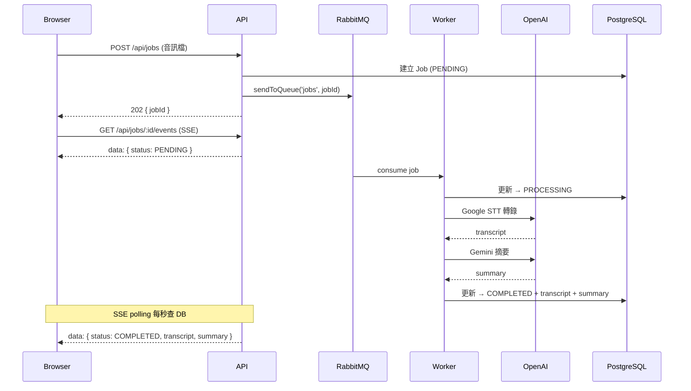

# 音訊轉錄與摘要服務

上傳音訊檔案（.mp3 / .wav），系統自動進行語音轉文字（Google Cloud STT）並產生 LLM 摘要（Gemini）。

## 快速啟動

```bash
cp .env.example .env
# 編輯 .env，填入 GCS_BUCKET、GEMINI_API_KEY 等 GCP 相關設定

# 將 GCP Service Account 金鑰放到 secrets/gcp-key.json
mkdir -p secrets
# cp /path/to/your-key.json secrets/gcp-key.json

# 本機啟動（掛載 GCP 憑證）
docker compose -f docker-compose.yml -f docker-compose.local.yml up --build
```

| 服務 | 網址 |
|------|------|
| 前端介面 | http://localhost:3000 |
| Swagger UI | http://localhost:3000/docs |
| RabbitMQ 管理介面 | http://localhost:15672 （guest / guest） |

## API

| 方法 | 路徑 | 說明 |
|------|------|------|
| POST | `/api/jobs` | 上傳音訊，建立任務（202） |
| GET | `/api/jobs/:id` | 查詢任務詳情 |
| GET | `/api/jobs` | 列出任務（?status=&page=&limit=） |
| GET | `/api/jobs/:id/events` | SSE 即時進度串流 |

**範例：**

```bash
# 上傳
curl -X POST http://localhost:3000/api/jobs -F "audio=@test.mp3"
# → { "success": true, "data": { "jobId": "uuid", "status": "PENDING" } }

# 查詢
curl http://localhost:3000/api/jobs/{jobId}

# SSE（完成前持續推送狀態）
curl -N http://localhost:3000/api/jobs/{jobId}/events
```

## 任務狀態流程

```
PENDING → PROCESSING → COMPLETED
                     ↘ FAILED
```

## 架構圖



## 技術架構

- **API**（Express 5 + TypeScript）：接收上傳、提供查詢、SSE 串流
- **Worker**（獨立 Node.js process）：消費佇列、呼叫 GCP、更新 DB
- **RabbitMQ**：非同步任務佇列（durable queue，prefetch=1）
- **PostgreSQL + Prisma**：任務狀態持久化
- **SSE**：API 以 DB polling（每秒）推送狀態，不需額外 pub/sub

## 設定說明

| 環境變數 | 說明 | 預設值 |
|----------|------|--------|
| `GCS_BUCKET` | GCS bucket 名稱（**必填**） | — |
| `GEMINI_API_KEY` | Gemini API 金鑰（**必填**） | — |
| `STT_LANGUAGE_CODE` | STT 語言代碼 | `cmn-Hant-TW` |
| `GOOGLE_APPLICATION_CREDENTIALS` | GCP Service Account 金鑰路徑 | 由 docker-compose.local.yml 注入 |
| `MAX_FILE_SIZE_MB` | 上傳限制（MB） | `100` |
| `DATABASE_URL` | PostgreSQL 連線字串 | 見 .env.example |
| `RABBITMQ_URL` | RabbitMQ 連線字串 | 見 .env.example |

## 本機開發（不用 Docker）

```bash
npm install
npx prisma migrate dev

# Terminal 1
npm run dev:api

# Terminal 2
npm run dev:worker
```

> 需要本機有 PostgreSQL 和 RabbitMQ，或用 `docker compose up postgres rabbitmq` 只啟動依賴服務。
